# ProvaHR

**The AI-native, open-source hiring platform.**
AI works for HR — candidates prove their skill. Hiring runs on proof, not polish.

> 🚀 **Watch the demo**: [`docs/assets/provehr-sales-pitch.mp4`](docs/assets/provehr-sales-pitch.mp4) — a 2-minute labeled walkthrough of the entire product.

---

## What it does

| For HR | For candidates | For the platform owner |
|---|---|---|
| Describe a person (LinkedIn screenshot, URLs, notes) → AI drafts the JD | Take a real, role-specific skill test — no fluff | Onboard companies (tenants) with their own admins |
| Design a test blueprint; the platform seals a question pool **nobody can enumerate** — not even admins | Code answers execute in a hardened sandbox against hidden cases | Each tenant brings its own LLM keys (OpenAI / Anthropic / Azure / Ollama) |
| See the **X-ray**: verdicts, sandbox runs, AI-likelihood flags, signals | See only *"Submitted ✓"* — no scores, no feedback, ever | Per-tenant Keycloak realms, sandbox image templates, team RBAC |
| Reject with a mandatory reason — AI can **never** reject | Swipe-style judgments on mobile; standard questionnaire on web | Two-tier AI prompts: platform rules (root) + role-specific (HR) |

## Demo videos

- **[`docs/assets/provehr-sales-pitch.mp4`](docs/assets/provehr-sales-pitch.mp4)** — the full sales-pitch demo: 12 labeled chapters (platform setup, tenant onboarding, the AI loop, candidate experience, the X-ray, human pipeline).
- **[`docs/assets/demo-two-tier-prompts.mp4`](docs/assets/demo-two-tier-prompts.mp4)** — the two-tier system-prompt feature in detail.

## UI / UX

### The platform (super admin)

| | |
|---|---|
| 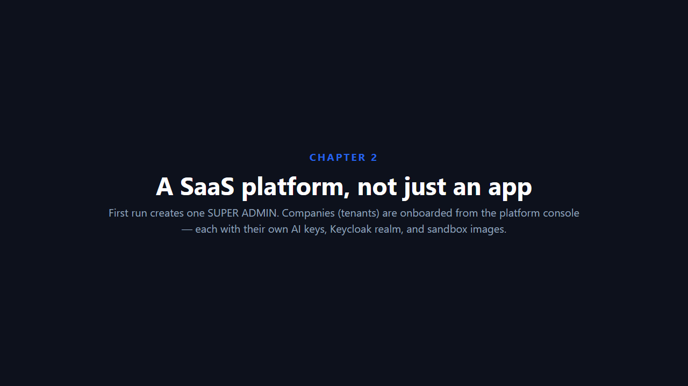 | 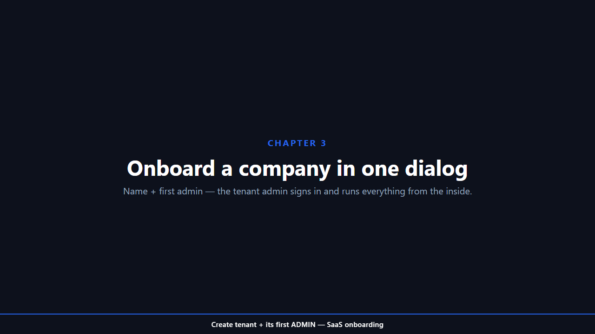 |
| *Super-admin console: tenants, sandbox templates, auth mode* | *Runtime auth switch — Local ↔ Keycloak, no restart; lockout-proof* |

### The company admin (HR)

| | |
|---|---|
| 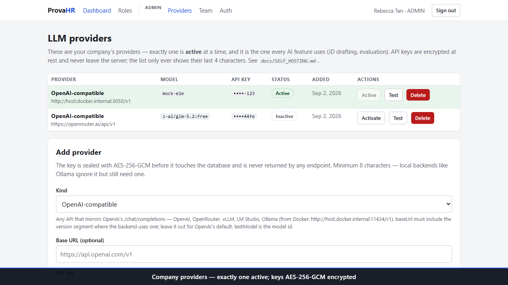 | 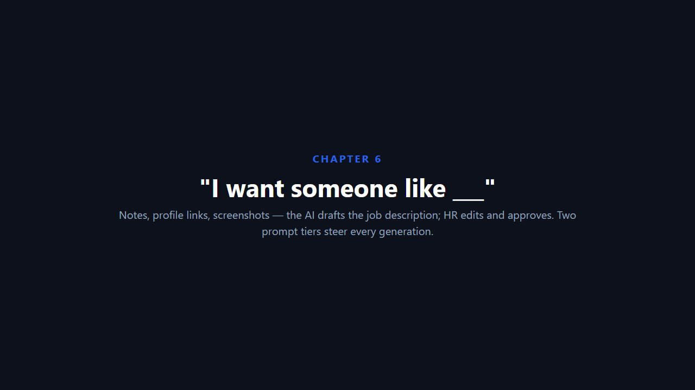 |
| *Per-tenant LLM providers — encrypted keys, one-click test* | *Two-tier prompts: platform rules (read-only) + role-specific (editable)* |

### The AI loop

| | |
|---|---|
| 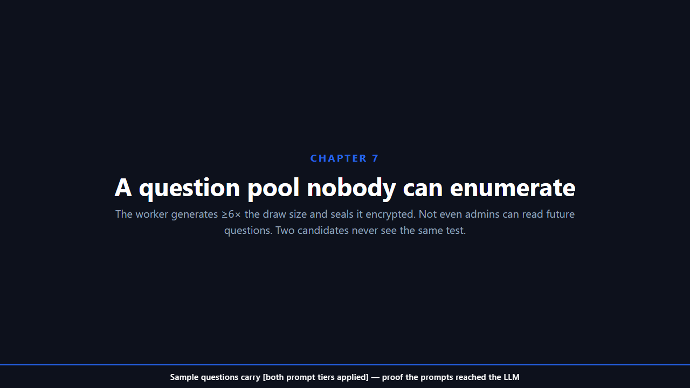 | 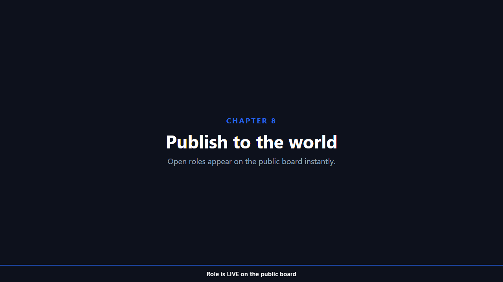 |
| *AI-drafted JD with both prompt tiers applied* | *Sealed question pool — ≥6× draw, encrypted, counts only* |

### The candidate

| | |
|---|---|
| 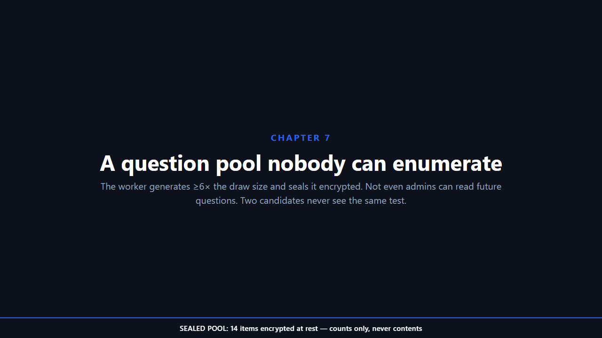 | 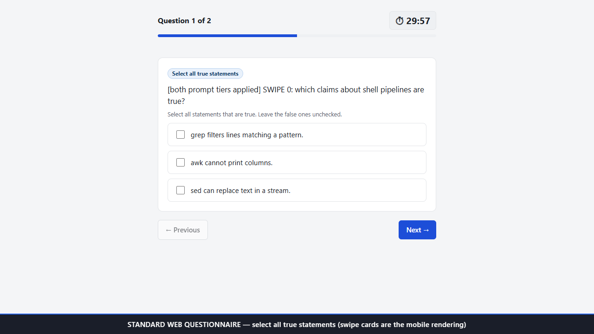 |
| *Apply → the one-time test link, shown exactly once* | *Standard web questionnaire — select-all checkboxes (swipe on mobile)* |

| | |
|---|---|
| 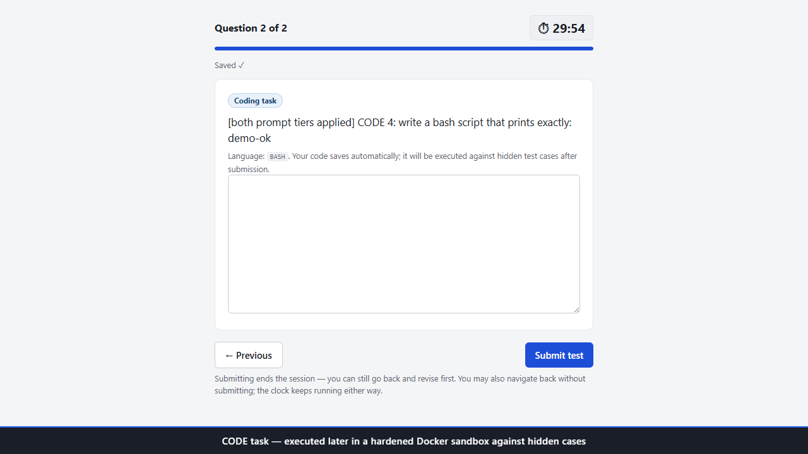 | 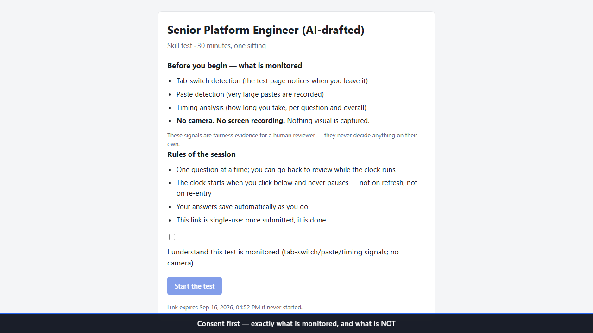 |
| *Code task — executed in a hardened Docker sandbox after submission* | *"Submitted ✓" — the candidate sees nothing else, ever* |

### The HR X-ray

| | |
|---|---|
| 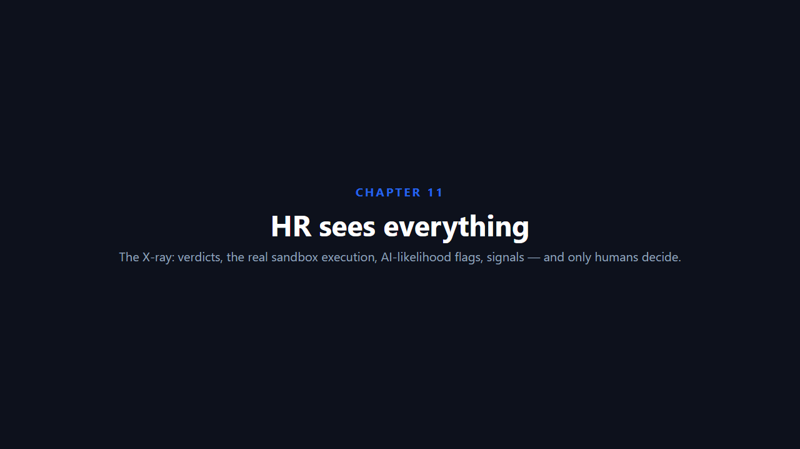 | 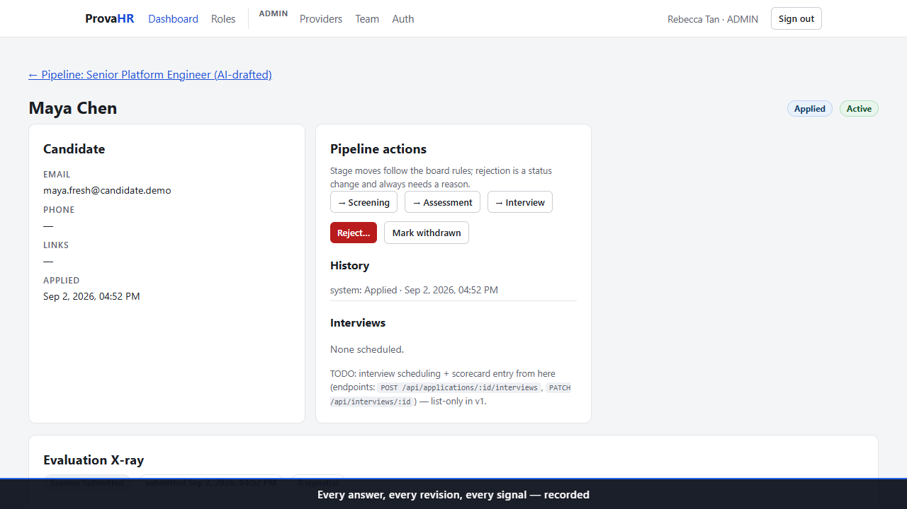 |
| *Every answer, every sandbox run, every AI flag — for HR only* | *Humans decide — rejection always demands a reason* |

---

## Quickstart

**Prerequisites:** Docker (Docker Desktop), Node.js ≥ 20.

```bash
git clone <your-repo> provahr && cd provahr
docker compose up -d          # db + keycloak + api + worker
```

Then open **http://localhost:4000/setup** — the wizard creates your **super admin** (the platform owner). From the super-admin console at **http://localhost:5173**, create your first company.

For the web portal (dev mode):

```bash
npm install                   # workspaces
npm run dev --workspace @provahr/web   # http://localhost:5173 (proxies /api → :4000)
```

For local development without Docker, see [docs/SELF_HOSTING.md](docs/SELF_HOSTING.md).

## What's inside

```
apps/api/          REST API + worker (Express 4 · TypeScript · Prisma · PostgreSQL)
apps/web/          HR console + public board + candidate test portal (React 18 · Vite)
apps/mobile/       Candidate app (React Native + Expo — swipe gestures)
packages/shared/   Cross-app TypeScript contracts
deploy/keycloak/   Realm export (provahr) for SSO
docs/              BIBLE (the map of record) · API · RBAC · SELF_HOSTING · DATA_MODEL · TESTING
```

## The product's laws

1. **AI flags, humans decide.** No automated rejection exists anywhere in the codebase.
2. **The pool is sealed.** Question items are encrypted at rest and readable by no user — not even admins.
3. **The clock never pauses.** A test session is one sitting; the deadline is set at start and never extended.
4. **The candidate sees nothing.** No scores, no feedback, no verdicts — only "Submitted."
5. **Open source, self-hosted.** Your data, your infrastructure, your rules.

## License

**AGPL-3.0-only** — see [LICENSE](LICENSE) and [NOTICE.md](NOTICE.md).

> ⚠️ **What AGPL means for you:** if you run a modified version of ProvaHR as a network service (SaaS), you must offer the source code of your modifications to its users. This keeps the platform — and any improvements to it — open for everyone. For internal/self-hosted use without modification, the license imposes no obligations beyond keeping the notice.

## Documentation

| Doc | Purpose |
|---|---|
| [docs/BIBLE.md](docs/BIBLE.md) | **The map of record** — architecture, data flow, sequence diagrams, security model |
| [docs/API.md](docs/API.md) | Full endpoint reference (all routes, roles, shapes) |
| [docs/RBAC.md](docs/RBAC.md) | Identity: local, Keycloak, multi-issuer, per-company realms |
| [docs/SELF_HOSTING.md](docs/SELF_HOSTING.md) | Install, configure, operate (multi-tenant operator guide) |
| [docs/DATA_MODEL.md](docs/DATA_MODEL.md) | All 24 entities and their relationships |
| [docs/TESTING.md](docs/TESTING.md) | Test strategy, tiers, never-regress list |
| [docs/WALKTHROUGH.md](docs/WALKTHROUGH.md) | Founder demo walkthrough (~10 min) |
| [PROGRESS.md](PROGRESS.md) | Living tracker: phases, waves, QA history, backlog |

## Status

- **v1 (single-tenant MVP)** — complete, live-verified end-to-end.
- **v2 (SaaS multi-tenant platform)** — complete: super admin, company onboarding, per-tenant providers/keycloak/sandbox-templates, two-tier prompts.
- **525 tests** green (509 unit + 16 CI-gated integration).

Post-v2 backlog (tracked in PROGRESS.md): automated Playwright E2E tier, Stage-enum migration, shared rate-limiter store, data-level question variants, docker-socket isolation for multi-tenant sandboxing.
